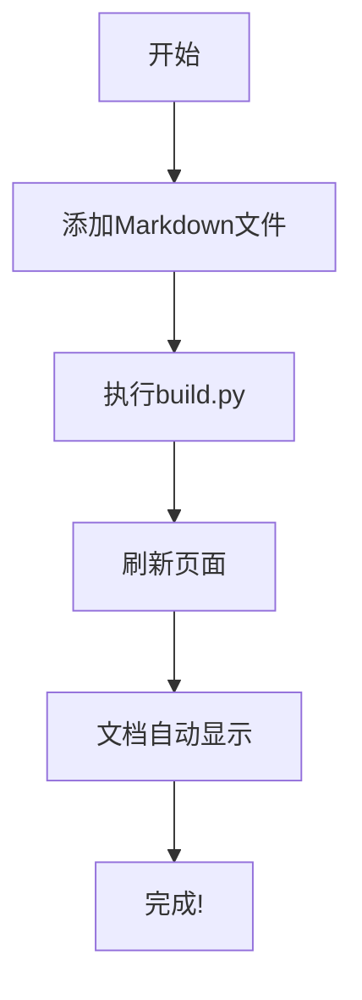

# EasyDocument 文档中心

欢迎使用 EasyDocument 文档系统。这是一个轻量级、免编译的纯静态前端文档系统，可以帮助您快速构建结构化的文档网站。

## 系统特点

- **简单易用**: 只需将 Markdown 或 HTML 文件添加到数据目录中
- **自动生成**: 系统会自动识别文档文件并构建导航结构
- **响应式设计**: 兼容各种设备尺寸，从手机到桌面电脑
- **现代界面**: 采用现代化设计，提供极致的用户体验
- **纯静态实现**: 不需要服务器支持，可部署在任何静态网站托管服务上
- **支持嵌套目录**: 无限层级的文档组织结构
- **完整导航系统**: 自动生成左侧目录树和右侧文档内容导航
- **交互式体验**: 代码复制、返回顶部、目录自动折叠等功能
- **Git集成功能**: 显示文档最后修改时间、贡献者信息
- **GitHub连接**: 支持展示贡献者头像、一键编辑功能

## 文档格式示例

EasyDocument 支持丰富的文档格式，包括但不限于：

### 代码示例与高亮

```javascript
// 一个简单的 JavaScript 示例
function sayHello(name) {
  return `Hello, ${name}!`;
}

console.log(sayHello('World')); // 输出: Hello, World!
```

### 表格

| 特性 | 支持情况 | 说明 |
|------|---------|------|
| Markdown | ✅ | 完全支持 |
| HTML | ✅ | 完全支持 |
| 代码高亮 | ✅ | 支持多种语言 |
| 数学公式 | ✅ | 通过 KaTeX 支持 |
| 图表 | ✅ | 通过 Mermaid 支持 |

### 数学公式

当 `a \ne 0` 时，方程 $ax^2 + bx + c = 0$ 有两个解，它们是:

$$x = {-b \pm \sqrt{b^2-4ac} \over 2a}$$

### 图表



## 快速上手

1. 在 `/data` 目录中添加您的 Markdown 或 HTML 文件
2. 按照目录结构组织您的文档
3. 运行 `build.py` 脚本更新文档路径
4. 刷新浏览器查看更新后的文档

查看 [快速入门](?path=快速入门/README.md) 获取更详细的使用教程。

## 文档组织

EasyDocument 通过文件夹结构来组织文档:

- 每个目录可以包含一个 `README.md` 作为该目录的介绍文档
- 其他 `.md` 或 `.html` 文件显示为该目录下的单独文档
- 支持无限嵌套的目录结构，自动生成导航

## 问题反馈

如果您在使用过程中遇到任何问题，请通过以下渠道反馈:

- [GitHub Issues](https://github.com/LoosePrince/EasyDocument/issues)