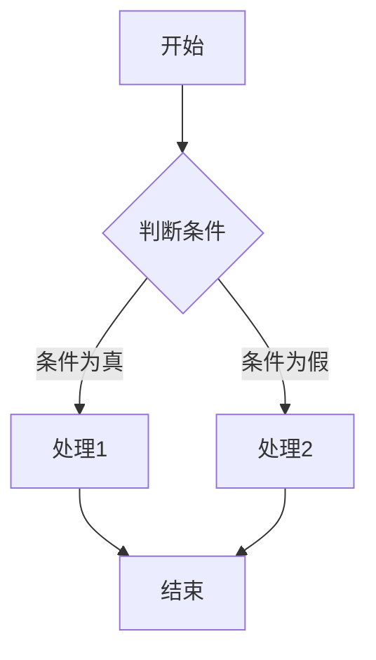

# 文档与插件配置

本文档详细介绍 EasyDocument 系统中文档（`document`）和插件（`extensions`）相关的配置选项，这些选项控制文档的加载和显示方式，以及各种扩展功能的启用与设置。

## 文档设置

文档设置控制 EasyDocument 如何加载、处理和显示文档文件。

> [IMPORTANT] 配置参数全面支持
>
> EasyDocument 系统现已确保所有 `document` 配置参数能正确影响整个系统的文档加载和处理：
> - ✅ **全局生效**: 所有配置参数在文档加载、链接处理、路径解析、侧边栏生成等各个环节中正确使用
> - ✅ **无硬编码**: 移除了所有硬编码的文件扩展名、索引文件名和目录路径
> - ✅ **智能缓存**: 文档缓存和预加载功能也使用配置的根目录和扩展名

### 可用配置项

| 配置项 | 类型 | 默认值 | 说明 |
|-------|------|-------|------|
| `root_dir` | 字符串 | `"data"` | 文档根目录 |
| `default_page` | 字符串 | `"README.md"` | 默认文档 |
| `index_pages` | 数组 | `["README.md", "README.html", "index.md", "index.html"]` | 索引页文件名 |
| `supported_extensions` | 数组 | `[".md", ".html"]` | 支持的文档扩展名 |
| `toc_depth` | 数字 | `3` | 目录深度，显示到几级（h1~hx）标题 |
| `toc_numbering` | 布尔值 | `true` | 目录是否显示编号（如1，2.3，5.1.3） |
| `toc_ignore_h1` | 布尔值 | `true` | 生成目录编号时是否忽略h1标题 |
| `toc_dynamic_expand` | 布尔值 | `true` | 是否启用目录动态展开功能 |
| `code_copy_button` | 布尔值 | `true` | 代码块是否显示复制按钮 |

### 详细说明

#### root_dir

设置文档文件的根目录，相对于项目根目录。所有文档路径都基于此目录。

```javascript
document: {
  root_dir: "docs" // 使用"docs"目录而不是默认的"data"目录
}
```

**影响范围**：
- ✅ 文档加载路径构建
- ✅ 缓存和预加载功能
- ✅ 链接解析和处理
- ✅ 面包屑导航路径

如果您有特殊的目录结构或需要从不同位置加载文档，可以调整此设置。系统会在所有相关功能中自动使用此配置。

#### default_page

设置当没有指定具体文档时默认加载的文档文件。

```javascript
document: {
  default_page: "index.md" // 使用index.md作为默认文档
}
```

**影响范围**：
- ✅ 无路径访问时的后备文档
- ✅ 根目录索引缺失时的默认文档
- ✅ 错误处理中的默认重定向

这通常是网站的主页或入口文档。

#### index_pages

设置目录的索引页文件名列表。当访问一个目录时，系统会按照这个列表顺序查找索引页。

```javascript
document: {
  index_pages: ["index.md", "README.md", "default.md"]
}
```

**影响范围**：
- ✅ 目录索引文件查找
- ✅ 侧边栏文件夹路径推断
- ✅ 目录访问重试逻辑
- ✅ 文档加载错误处理
- ✅ 搜索结果高亮逻辑

系统会按顺序检查目录中是否存在这些文件，并加载找到的第一个文件作为该目录的索引页。所有相关功能都会使用这个配置来识别索引文件。

#### supported_extensions

设置系统支持的文档文件扩展名。只有这些扩展名的文件会被识别为文档文件。

```javascript
document: {
  supported_extensions: [".md", ".html", ".txt"] // 添加对.txt文件的支持
}
```

**影响范围**：
- ✅ 文档类型识别和验证
- ✅ 内部链接处理和转换
- ✅ 右键菜单功能判断
- ✅ 路径解析扩展名检查
- ✅ 缓存和预加载文件过滤

添加更多扩展名可以支持更多类型的文档，但需确保系统能够正确渲染这些文件。系统的所有文档识别和处理逻辑都会使用这个配置。

#### toc_depth

设置文档目录（大纲）的显示深度，即显示到第几级标题。

```javascript
document: {
  toc_depth: 4 // 显示到h4级别的标题
}
```

对于结构复杂的文档，可以增加此值以显示更详细的目录；对于简单文档，减小此值可以使目录更简洁。

#### toc_numbering

控制文档目录中是否显示章节编号。

```javascript
document: {
  toc_numbering: false // 不显示章节编号
}
```

章节编号有助于理解文档结构，但在某些类型的文档中可能不需要。

#### toc_ignore_h1

控制生成目录编号时是否忽略h1标题。设置为`true`时，目录编号将从h2开始，避免所有章节都以"1."开头。

```javascript
document: {
  toc_ignore_h1: false // 包含h1标题在编号中
}
```

如果您的文档中每个页面只有一个h1标题，通常应保持此设置为`true`。

#### toc_dynamic_expand

控制目录是否启用动态展开功能。启用后，系统会根据当前阅读位置自动展开相关的目录项，提供更好的导航体验。

```javascript
document: {
  toc_dynamic_expand: false // 禁用目录动态展开功能
}
```

动态展开功能具有以下特点：
- 初始只显示设定深度（`toc_depth`）内的标题
- 滚动到某个标题时，自动展开其下一级标题
- 当滚动到深层级标题时，确保其父级标题和同级标题都可见
- 移动到新的章节时，会自动折叠不相关的深层级标题，保持目录简洁

这个功能特别适合层级结构复杂的文档，可以在保持目录简洁的同时，提供详细的导航信息。

#### code_copy_button

控制代码块是否显示复制按钮。

```javascript
document: {
  code_copy_button: false // 不显示代码复制按钮
}
```

复制按钮便于用户快速复制代码片段，但如果您的文档中很少包含代码，可以考虑禁用此功能。

## 插件与扩展

EasyDocument 支持多种插件和扩展来增强文档的功能和表现。从版本更新后，系统采用**智能动态加载机制**，只加载启用的扩展资源，显著提升页面加载性能。

> [IMPORTANT] 动态加载机制
>
> EasyDocument 现已实现智能扩展加载：
> - ✅ **按需加载**: 根据配置只加载启用的扩展库，减少不必要的资源加载
> - ✅ **性能优化**: 初始页面加载速度提升，只在需要时加载相应功能
> - ✅ **错误隔离**: 单个扩展加载失败不影响其他功能正常运行
> - ✅ **配置驱动**: 通过简单的配置开关即可控制功能启用/禁用

### 可用配置项

| 配置项 | 类型 | 默认值 | 说明 |
|-------|------|-------|------|
| `math` | 布尔值 | `true` | 数学公式支持(KaTeX) - 动态加载 |
| `highlight` | 布尔值 | `true` | 语法高亮 - 动态加载 |
| `mermaid` | 布尔值 | `true` | Mermaid图表渲染 - 动态加载 |
| `github` | 对象 | `{ ... }` | GitHub相关功能配置 |
| `git` | 对象 | `{ ... }` | Git相关功能配置 |

### 详细说明

#### math

控制是否启用数学公式渲染功能，基于KaTeX库。**系统采用动态加载机制**，只有在启用时才会加载KaTeX相关资源。

```javascript
extensions: {
  math: false // 禁用数学公式支持
}
```

**动态加载详情**：
- 启用时自动加载：KaTeX CSS样式、主库文件、auto-render插件
- 禁用时完全不加载相关资源，节省带宽和加载时间
- 加载失败时提供友好的错误提示，不影响其他功能

如果您的文档不包含数学公式，禁用此功能可以显著减少页面加载的资源。

#### highlight

控制是否启用代码语法高亮功能，基于Highlight.js库。**系统采用动态加载机制**，根据配置智能加载相关资源。

```javascript
extensions: {
  highlight: false // 禁用代码语法高亮
}
```

**动态加载详情**：
- 启用时自动加载：亮色主题CSS、暗色主题CSS、Highlight.js主库
- 自动适配暗黑模式切换，动态调整代码高亮主题
- 禁用时不加载任何语法高亮资源
- 加载失败时代码仍正常显示，只是没有语法着色

语法高亮使代码更易读，但如果您的文档中很少包含代码，可以考虑禁用此功能以提升加载性能。

#### mermaid

控制是否启用Mermaid图表渲染功能，支持流程图、时序图、甘特图等。**系统采用动态加载机制**，按需加载图表渲染库。

```javascript
extensions: {
  mermaid: false // 禁用Mermaid图表渲染
}
```

**动态加载详情**：
- 启用时自动加载：Canvg依赖库、Mermaid主库
- 自动适配暗黑模式，智能切换图表主题
- 提供图表复制、下载等增强功能
- 禁用时完全不加载图表相关资源
- 加载失败时显示友好的错误提示

Mermaid允许您在文档中使用文本描述来创建图表，如果不需要此功能，可以禁用以显著减少资源加载。

#### github

配置GitHub相关功能，详见[GitHub与Git功能配置](配置详解/GitHub与Git功能.md)文档。

```javascript
extensions: {
  github: {
    enable: true,
    repo_url: "https://github.com/yourname/yourrepo",
    edit_link: true,
    branch: "main",
    show_avatar: true
  }
}
```

#### git

配置Git相关功能，详见[GitHub与Git功能配置](配置详解/GitHub与Git功能.md)文档。

```javascript
extensions: {
  git: {
    enable: true,
    show_last_modified: true,
    show_contributors: true
  }
}
```

## 功能交互与扩展

EasyDocument的文档和插件配置项之间存在一些交互关系：

1. **文档格式与扩展**：`supported_extensions`决定哪些文件被识别为文档，而插件扩展则决定如何渲染这些文档中的特殊内容。

2. **目录设置**：`toc_depth`、`toc_numbering`、`toc_ignore_h1`和`toc_dynamic_expand`共同决定文档右侧目录的显示方式和交互行为。

3. **代码相关设置**：`code_copy_button`与`highlight`通常配合使用，前者提供复制功能，后者提供语法高亮。

4. **路径与缓存**：`root_dir`、`index_pages`和`supported_extensions`共同影响文档缓存和预加载功能的工作方式。

5. **动态加载优化**：扩展的动态加载机制与暗黑模式、缓存系统等功能深度集成，确保在各种使用场景下的最佳性能表现。

### 性能优化建议

根据动态加载机制，您可以通过以下方式优化站点性能：

```javascript
// 针对纯文档站点的轻量化配置
extensions: {
  math: false,        // 如无数学公式，禁用以节省~200KB
  highlight: false,   // 如无代码，禁用以节省~100KB
  mermaid: false,     // 如无图表，禁用以节省~300KB
  // GitHub和Git功能保持启用，资源占用较小
}

// 针对技术文档的完整配置
extensions: {
  math: true,         // 支持数学公式
  highlight: true,    // 代码语法高亮
  mermaid: true,      // 流程图支持
  // 完整功能，自动按需加载
}
```

## 数学公式示例

当启用`math`扩展时，可以在Markdown文档中使用LaTeX语法编写数学公式：

- 行内公式：`$E=mc^2$`
- 块级公式：`$$\sum_{i=1}^{n} i = \frac{n(n+1)}{2}$$`

## Mermaid图表示例

当启用`mermaid`扩展时，可以在Markdown文档中创建各种图表：

````markdown

````

## 完整配置示例

```javascript
// 文档设置 - 所有参数现已全局生效
document: {
  root_dir: "/data",              // ✅ 影响所有文档加载路径
  default_page: "README.md",      // ✅ 影响默认文档选择
  index_pages: [                  // ✅ 影响所有索引文件识别
    "README.md", 
    "index.md", 
    "index.html"
  ],
  supported_extensions: [         // ✅ 影响所有文档类型识别
    ".md", 
    ".html"
  ],
  toc_depth: 3,                   // 目录显示深度
  toc_numbering: true,            // 目录编号开关
  toc_ignore_h1: true,            // 忽略h1标题编号
  toc_dynamic_expand: true,       // 动态目录展开
  code_copy_button: true          // 代码复制按钮
},

// 插件与扩展 - 支持动态加载
extensions: {
  math: true,                     // KaTeX数学公式 - 动态加载
  highlight: true,                // 代码语法高亮 - 动态加载
  mermaid: true,                  // Mermaid图表 - 动态加载
  github: {
    enable: true,
    repo_url: "https://github.com/LoosePrince/EasyDocument",
    edit_link: true,
    branch: "main",
    show_avatar: true
  },
  git: {
    enable: true,
    show_last_modified: true,
    show_contributors: true
  }
}
```

### 自定义配置示例

如果您需要自定义目录结构和文件类型支持：

```javascript
document: {
  root_dir: "/docs",              // 使用docs目录
  default_page: "index.md",       // 默认首页
  index_pages: [                  // 自定义索引文件优先级
    "index.md",
    "INDEX.md", 
    "readme.md",
    "README.md",
    "default.html"
  ],
  supported_extensions: [         // 支持更多文件类型
    ".md", 
    ".html", 
    ".txt",
    ".adoc"                       // AsciiDoc格式
  ]
},

// 高性能配置示例
extensions: {
  math: false,                    // 禁用数学公式，节省200KB
  highlight: true,                // 保留语法高亮，技术文档必需
  mermaid: false,                 // 禁用图表，节省300KB
  github: { enable: true },       // 保留GitHub功能
  git: { enable: true }           // 保留Git信息
}
```

> **注意**: 
> - 添加新的文件扩展名时，确保系统能够正确处理和渲染这些文件格式。
> - 动态加载机制确保只有启用的扩展才会加载相应资源，可放心配置。

## 动态加载技术详解

### 加载机制

EasyDocument 的动态加载系统在应用初始化时根据配置决定加载哪些扩展：

```javascript
// main.js 中的加载逻辑
async function loadExtensions() {
    const extensions = config.extensions;
    const loadPromises = [];
    
    // 根据配置决定加载哪些资源
    if (extensions.math) {
        loadPromises.push(loadKaTeX());
    }
    
    if (extensions.highlight) {
        loadPromises.push(loadHighlightJS());
    }
    
    if (extensions.mermaid) {
        loadPromises.push(loadMermaid());
    }
    
    // 并行加载所有启用的扩展
    await Promise.all(loadPromises);
}
```

### 错误处理

每个扩展都有独立的错误处理机制：

- **KaTeX**: 加载失败时数学公式显示为原始LaTeX代码
- **Highlight.js**: 加载失败时代码显示为纯文本，不影响阅读
- **Mermaid**: 加载失败时图表显示友好的错误提示

### 资源大小对比

| 扩展 | 启用时加载 | 禁用时节省 |
|------|-----------|-----------|
| KaTeX | ~200KB (CSS + JS) | 100% |
| Highlight.js | ~100KB (CSS + JS) | 100% |
| Mermaid | ~300KB (含依赖) | 100% |
| **总计** | ~600KB | 最多节省600KB |

### 兼容性说明

- 动态加载机制向后兼容所有现有配置
- 扩展加载失败时系统仍保持完全可用
- 支持所有现代浏览器（IE11+）

## 相关文档

- [配置详解](配置详解/README.md)
- [GitHub与Git功能](配置详解/GitHub与Git功能.md)
- [Markdown语法指南](快速入门/Markdown语法.md) 