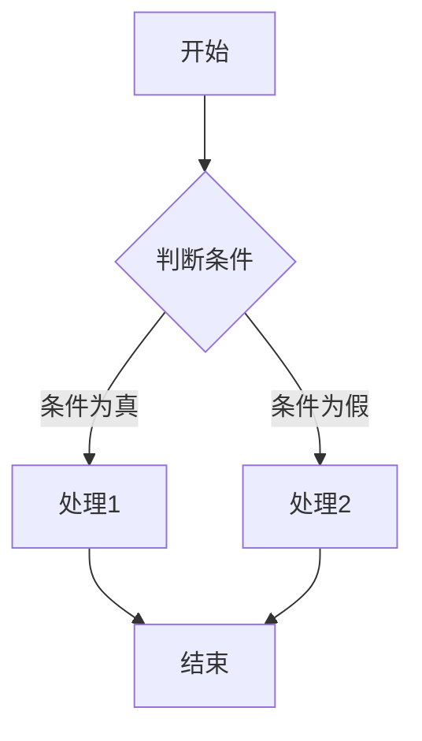

# 文档与插件配置

本文档详细介绍 EasyDocument 系统中文档（`document`）和插件（`extensions`）相关的配置选项，这些选项控制文档的加载和显示方式，以及各种扩展功能的启用与设置。

## 文档设置

文档设置控制 EasyDocument 如何加载、处理和显示文档文件。

### 可用配置项

| 配置项 | 类型 | 默认值 | 说明 |
|-------|------|-------|------|
| `root_dir` | 字符串 | `"data"` | 文档根目录 |
| `default_page` | 字符串 | `"README.md"` | 默认文档 |
| `index_pages` | 数组 | `["README.md", "README.html", "index.md", "index.html"]` | 索引页文件名 |
| `supported_extensions` | 数组 | `[".md", ".html"]` | 支持的文档扩展名 |
| `toc_depth` | 数字 | `3` | 目录深度，显示到几级（h1~hx）标题 |
| `toc_numbering` | 布尔值 | `true` | 目录是否显示编号（如1，2.3，5.1.3） |
| `toc_ignore_h1` | 布尔值 | `true` | 生成目录编号时是否忽略h1标题 |
| `toc_dynamic_expand` | 布尔值 | `true` | 是否启用目录动态展开功能 |
| `code_copy_button` | 布尔值 | `true` | 代码块是否显示复制按钮 |

### 详细说明

#### root_dir

设置文档文件的根目录，相对于项目根目录。所有文档路径都基于此目录。

```javascript
document: {
  root_dir: "docs" // 使用"docs"目录而不是默认的"data"目录
}
```

如果您有特殊的目录结构或需要从不同位置加载文档，可以调整此设置。

#### default_page

设置当没有指定具体文档时默认加载的文档文件。

```javascript
document: {
  default_page: "index.md" // 使用index.md作为默认文档
}
```

这通常是网站的主页或入口文档。

#### index_pages

设置目录的索引页文件名列表。当访问一个目录时，系统会按照这个列表顺序查找索引页。

```javascript
document: {
  index_pages: ["index.md", "README.md", "default.md"]
}
```

系统会按顺序检查目录中是否存在这些文件，并加载找到的第一个文件作为该目录的索引页。

#### supported_extensions

设置系统支持的文档文件扩展名。只有这些扩展名的文件会被识别为文档文件。

```javascript
document: {
  supported_extensions: [".md", ".html", ".txt"] // 添加对.txt文件的支持
}
```

添加更多扩展名可以支持更多类型的文档，但需确保系统能够正确渲染这些文件。

#### toc_depth

设置文档目录（大纲）的显示深度，即显示到第几级标题。

```javascript
document: {
  toc_depth: 4 // 显示到h4级别的标题
}
```

对于结构复杂的文档，可以增加此值以显示更详细的目录；对于简单文档，减小此值可以使目录更简洁。

#### toc_numbering

控制文档目录中是否显示章节编号。

```javascript
document: {
  toc_numbering: false // 不显示章节编号
}
```

章节编号有助于理解文档结构，但在某些类型的文档中可能不需要。

#### toc_ignore_h1

控制生成目录编号时是否忽略h1标题。设置为`true`时，目录编号将从h2开始，避免所有章节都以"1."开头。

```javascript
document: {
  toc_ignore_h1: false // 包含h1标题在编号中
}
```

如果您的文档中每个页面只有一个h1标题，通常应保持此设置为`true`。

#### toc_dynamic_expand

控制目录是否启用动态展开功能。启用后，系统会根据当前阅读位置自动展开相关的目录项，提供更好的导航体验。

```javascript
document: {
  toc_dynamic_expand: false // 禁用目录动态展开功能
}
```

动态展开功能具有以下特点：
- 初始只显示设定深度（`toc_depth`）内的标题
- 滚动到某个标题时，自动展开其下一级标题
- 当滚动到深层级标题时，确保其父级标题和同级标题都可见
- 移动到新的章节时，会自动折叠不相关的深层级标题，保持目录简洁

这个功能特别适合层级结构复杂的文档，可以在保持目录简洁的同时，提供详细的导航信息。

#### code_copy_button

控制代码块是否显示复制按钮。

```javascript
document: {
  code_copy_button: false // 不显示代码复制按钮
}
```

复制按钮便于用户快速复制代码片段，但如果您的文档中很少包含代码，可以考虑禁用此功能。

## 插件与扩展

EasyDocument 支持多种插件和扩展来增强文档的功能和表现。

### 可用配置项

| 配置项 | 类型 | 默认值 | 说明 |
|-------|------|-------|------|
| `math` | 布尔值 | `true` | 数学公式支持(KaTeX) |
| `highlight` | 布尔值 | `true` | 语法高亮 |
| `mermaid` | 布尔值 | `true` | Mermaid图表渲染 |
| `github` | 对象 | `{ ... }` | GitHub相关功能配置 |
| `git` | 对象 | `{ ... }` | Git相关功能配置 |

### 详细说明

#### math

控制是否启用数学公式渲染功能，基于KaTeX库。

```javascript
extensions: {
  math: false // 禁用数学公式支持
}
```

如果您的文档不包含数学公式，禁用此功能可以减少页面加载的资源。

#### highlight

控制是否启用代码语法高亮功能。

```javascript
extensions: {
  highlight: false // 禁用代码语法高亮
}
```

语法高亮使代码更易读，但如果您的文档中很少包含代码，可以考虑禁用此功能。

#### mermaid

控制是否启用Mermaid图表渲染功能，支持流程图、时序图、甘特图等。

```javascript
extensions: {
  mermaid: false // 禁用Mermaid图表渲染
}
```

Mermaid允许您在文档中使用文本描述来创建图表，如果不需要此功能，可以禁用以减少资源加载。

#### github

配置GitHub相关功能，详见[GitHub与Git功能配置](配置详解/GitHub与Git功能.md)文档。

```javascript
extensions: {
  github: {
    enable: true,
    repo_url: "https://github.com/yourname/yourrepo",
    edit_link: true,
    branch: "main",
    show_avatar: true
  }
}
```

#### git

配置Git相关功能，详见[GitHub与Git功能配置](配置详解/GitHub与Git功能.md)文档。

```javascript
extensions: {
  git: {
    enable: true,
    show_last_modified: true,
    show_contributors: true
  }
}
```

## 功能交互与扩展

EasyDocument的文档和插件配置项之间存在一些交互关系：

1. **文档格式与扩展**：`supported_extensions`决定哪些文件被识别为文档，而插件扩展则决定如何渲染这些文档中的特殊内容。

2. **目录设置**：`toc_depth`、`toc_numbering`、`toc_ignore_h1`和`toc_dynamic_expand`共同决定文档右侧目录的显示方式和交互行为。

3. **代码相关设置**：`code_copy_button`与`highlight`通常配合使用，前者提供复制功能，后者提供语法高亮。

## 数学公式示例

当启用`math`扩展时，可以在Markdown文档中使用LaTeX语法编写数学公式：

- 行内公式：`$E=mc^2$`
- 块级公式：`$$\sum_{i=1}^{n} i = \frac{n(n+1)}{2}$$`

## Mermaid图表示例

当启用`mermaid`扩展时，可以在Markdown文档中创建各种图表：

````markdown

````

## 完整配置示例

```javascript
// 文档设置
document: {
  root_dir: "data",
  default_page: "README.md",
  index_pages: ["README.md", "index.md"],
  supported_extensions: [".md", ".html"],
  toc_depth: 3,
  toc_numbering: true,
  toc_ignore_h1: true,
  toc_dynamic_expand: true,
  code_copy_button: true
},

// 插件与扩展
extensions: {
  math: true,
  highlight: true,
  mermaid: true,
  github: {
    enable: true,
    repo_url: "https://github.com/LoosePrince/EasyDocument",
    edit_link: true,
    branch: "main",
    show_avatar: true
  },
  git: {
    enable: true,
    show_last_modified: true,
    show_contributors: true
  }
}
```

## 相关文档

- [配置详解](配置详解/README.md)
- [GitHub与Git功能](配置详解/GitHub与Git功能.md)
- [Markdown语法指南](快速入门/Markdown语法.md) 